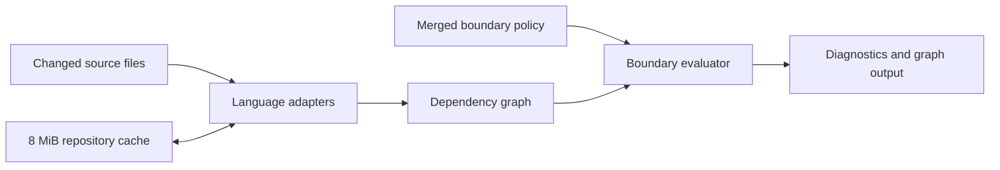

# Build a fast, polyglot import-boundary linter

Build a standalone C CLI that rejects dependency edges which cross an intended service, component, package, or Proto boundary.

## Contents

- [1. Enforcement contract](#1-enforcement-contract)
- [2. Configuration and inheritance](#2-configuration-and-inheritance)
- [3. Analyzer and cache](#3-analyzer-and-cache)
- [4. Commands and graph output](#4-commands-and-graph-output)
- [5. Delivery and acceptance](#5-delivery-and-acceptance)

## 1. Enforcement contract

Imports are the first enforcement seam. Call-chain analysis can build on the same graph after import checks are trustworthy.

| Finding | Default mode | Strict mode |
| --- | --- | --- |
| Direct traversal into a sibling service's internals | Error | Error |
| Explicit configured boundary violation | Error | Error |
| Inferred boundary with incomplete evidence | Advisory | Error |
| Unresolved import | Advisory | Error |

```text
services/orders/create.ts
  -> ../billing/internal/ledger.ts  TL1001 boundary violation
  -> ../billing/api/index.ts        allowed public entry
```

Zero-configuration analysis must fail on obvious sibling-service traversal. Discovery may suggest additional boundaries, but inference cannot weaken an explicit rule.

Initial files:

- `src/imports.c`
- `src/boundaries.c`
- `tests/imports_test.c`

## 2. Configuration and inheritance

One root rc file defines repository policy. A nested rc file inherits its parent configuration. Nested maps merge; child scalar and array values replace parent values.

```toml
version = 1
strict = false

[cache]
max_mib = 8

[boundaries.billing]
root = "services/billing"
public = ["api/**", "proto/**"]
allow = ["shared/**"]
```

The same model supports `.tree-legibilityrc.toml`, `.tree-legibilityrc.json`, and `.tree-legibilityrc.yaml`. Multiple rc files in one directory are an error.

```text
repo/.tree-legibilityrc.toml
  services/billing/.tree-legibilityrc.toml
    root and allow are inherited
    public is replaced by the child value
```

Initial files:

- `src/config.c`
- `include/tree_legibility/config.h`
- `tests/config_test.c`

## 3. Analyzer and cache

The executable is C11 with no runtime dependency. Language adapters produce the same file, symbol, and import-edge model for TypeScript, JavaScript, Python, Go, and Proto sources.



Tree-sitter adapters are the target parser layer. The first vertical slice may use lexical adapters behind that interface so the graph and enforcement contracts can be tested before grammars are vendored.

The disposable cache lives at `.tree-legibility/cache/` and defaults to an 8 MiB hard limit. A key covers tool version, parser version, effective configuration, path, and source content. Eviction is least-recently-used by stored bytes.

Performance budgets:

- `--help` starts in at most 10 ms in a release build.
- A warm one-file check takes at most 50 ms in the 10,000-file fixture.
- The cache stays within its configured limit after every successful command.

Initial files:

- `src/scanner.c`
- `src/graph.c`
- `src/cache.c`

## 4. Commands and graph output

The standalone CLI is the source of truth. ESLint, Ruff, golangci-lint, editors, and CI consume stable output instead of owning separate rule implementations.

```text
tree-legibility check [path] [--strict] [--format text|json]
tree-legibility discover [path] [--format text|json]
tree-legibility graph [path] [--format json|html]
```

JSON graph output uses a node and edge document suitable for JSONCrack-like rendering. A violation edge includes its rule, source location, owner, and suggested public entry.

```json
{
  "nodes": [
    {
      "id": "orders/create.ts",
      "boundary": "orders"
    }
  ],
  "edges": [
    {
      "from": "orders/create.ts",
      "to": "billing/internal/ledger.ts",
      "status": "violation"
    }
  ]
}
```

Exit codes are stable.

- `0` means the graph is clean.
- `1` means policy findings exist.
- `2` means the input or configuration is invalid.

Relevant references

- [Dependency Cruiser graph output](https://github.com/sverweij/dependency-cruiser)
- [Nx project graph and boundaries](https://nx.dev/docs/features/enforce-module-boundaries)

## 5. Delivery and acceptance

The first vertical slice proves the core path before adding every parser and rc syntax.

| Phase | Result |
| --- | --- |
| Foundation | CMake build, bounded ignore policy, diagnostics, and tests |
| Import slice | TypeScript and JavaScript imports with service-boundary failures |
| Polyglot | Python, Go, and Proto adapters with shared fixtures |
| Policy | TOML, JSON, and YAML parity with parent-child merging |
| Insight | Discovery, incremental cache, JSON graph, and interactive HTML |

The import slice is complete when two sibling services produce one deterministic `TL1001` diagnostic, permit a public entry, emit equivalent JSON, and pass under AddressSanitizer.

Initial files

- `CMakeLists.txt`
- `src/main.c`
- `tests/fixtures/services/`
- `.github/workflows/ci.yml`
